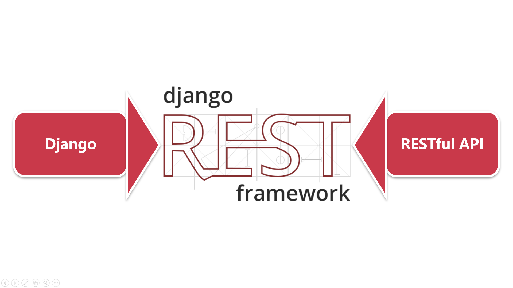
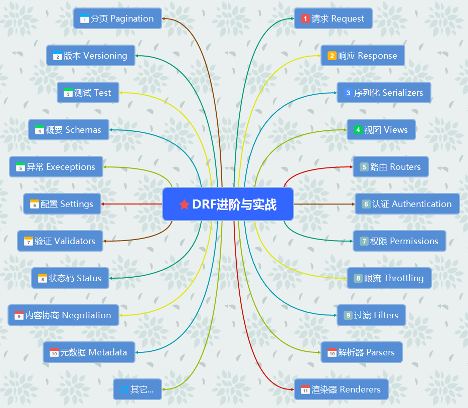

## Django REST framework快速入门

> 快速入门Django REST framework，学会开发一套自己的Restful API服务，并且自动生成API文档

​	API接口开发无需费时费力，本课程将从零开始引导同学们快速开发自己的Restful  API接口，从Django项目环境搭建、API接口生成数据、Postman接口测试到DRF认证方式的讲解，通过一个典型的课程信息接口（含增删改查），给同学们讲解完DRF中的序列化（serializers）、视图（viewsets）、路由（routers）、认证（authentication）、权限（permission），为将来前后端分离项目的开发打下基础。

### 课程9个核心技术点

1.  深入理解什么是Restful API
2.  Django REST framework组件介绍
3.  DRF中的序列化Serializers
4.  Django的views开发API接口
5.  DRF的多种视图api_view/APIView/GenericAPIView/viewsets
6.  Django的URLs与DRF的Routers
7.  如何使用DRF的API接口文档
8.  API测试神器Postman
9.  DRF的认证和权限

### 适合人群

​	任何想学习Python前后端分离项目开发的同学。熟练Python语法，有Django项目基础。

### 第一章 课程介绍

#### 1.1 课程内容与导学

​	介绍本课程的学习内容和目标，如何学习本课程，引导学生对Django REST framework有一个基础的了解，并能够在课程结束后独立使用DRF完成简单的Restful API接口开发。

### 第二章 Django REST framework介绍和项目准备

#### 2.1 前后端分离介绍

​	前后端分离与不分离的区别，前后端分离项目的优劣。

#### 2.2 深入理解什么是RESTful API

​	REST  API介绍，RESTful API接口设计的规范，有哪些最佳实践。

#### 2.3 Pycharm搭建项目开发环境

​	搭建Django项目开发环境，如何在Pycharm中设置Django  server，点击“run”就直接运行项目。

#### 2.4 Django REST framework介绍和安装

​	Django  REST framework的组件介绍，让大家对DRF有一个初步的了解；安装DRF以及coreapi，Markdown等，介绍各自的功能场景。

### 第三章 DRF中的序列化Serializers

#### 3.1 开发课程信息模型类

​	创建课程应用，课程信息的模型类开发，讲解各字段和参数的含义，生成数据表。

#### 3.2 什么是序列化

​	序列化介绍，序列化对象与反序列化对象的概念，如何重写.save()方法保存实例，如何使用验证器。

#### 3.3 如何继承ModelSerializer序列化模型类

​	讲解如何序列化模型类中指定字段，关系字段的序列化深度，指定只读字段。

#### 3.4 带URL的HyperlinkedModelSerializer

​	实现带URL字段的序列化结果，绝对和相对URL，如何更改URL字段名称。

### 第四章 DRF的视图和路由

#### 4.1 Django的views开发RESTful  API接口

​	讲解Django的views开发课程信息的CRUD接口，包括函数视图，类视图，通用类视图分别怎么写。

#### 4.2 DRF中的装饰器api_view

​	如何使用api_view装饰函数，响应对应的HTTP方法，对比学习Django的FBV。

#### 4.3 如何使用Postman测试API接口

​	Postman安装和介绍，演示如何使用Postman测试前面课程信息的Restfu  API接口。

#### 4.4 DRF中的视图APIView

​	如何使用类视图APIView开发RESTful  API接口，Response的处理。

#### 4.5 DRF中的通用类视图GenericAPIView

​	如何使用GenericAPIView开发RESTful  API接口，mixin与多种通用CRUD类视图的继承关系。

#### 4.6 DRF的viewsets开发课程信息的增删改查接口

​	讲解DRF的viewsets开发课程信息的CRUD接口，与上一小节对比学习，演示DRF写RESTful  API接口的效率。

#### 4.7 Django的URLs与DRF的Routers

​	讲解Django中urlpatterns的写法，路由课程信息接口，以及如何使用DRF的Routers更快更省事。

### 第五章 DRF的认证和权限

#### 5.1 DRF认证方式介绍

​	讲解常用的认证方式BasicAuthentication和SessionAuthentication，认证过程，请求头和响应头的变化。

#### 5.2 Django信号机制自动生成Token

​	TokenAuthentication介绍和配置，如何使用Django信号机制为用户自动生成Token，提供获取Token的API接口。

#### 5.3 DRF的权限控制

​	讲解权限检测后的处理，认证URL设置，全局权限控制与ViewSet的权限。

### 第六章 如何使用DRF的API接口文档

#### 6.1 如何生成API接口文档

​	设置DEFAULT_SCHEMA_CLASS和docs路由，访问文档页面。

#### 6.2 DRF的概要使用方法介绍

​	DRF的概要功能讲解，如何配置认证，如何与接口数据交互。

### 第七章 课程总结

#### 7.1 课程总结

​	三种视图开发方式的比较，给未来的实战课来个预告。
    

